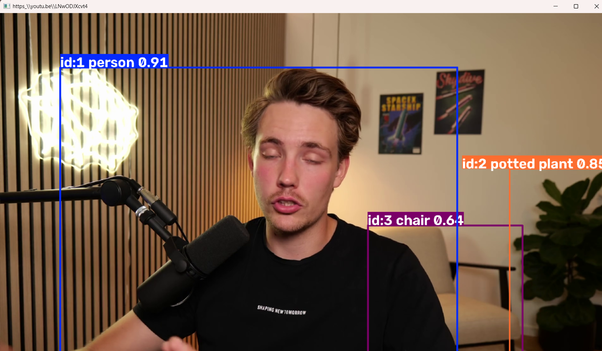

        this is the first time using the model, it worked. 

    model is very friendly

    terminal log :

Found https://ultralytics.com/images/bus.jpg locally at bus.jpg
image 1/1 C:\Users\dummyking\Documents\project\eyes_of_thousands\eyes_of_thousands_yard\bus.jpg: 640x480 4 persons, 1 bus, 12.0ms
Speed: 92.3ms preprocess, 12.0ms inference, 34.7ms postprocess per image at shape (1, 3, 640, 480)
Results saved to C:\Users\dummyking\Documents\project\eyes_of_thousands\eyes_of_thousands_yard\runs\detect\predict-3
PS C:\Users\dummyking\Documents\project\eyes_of_thousands\eyes_of_thousands_yard> 

worked with video.  Finding ways for it to find and work with live video as well
